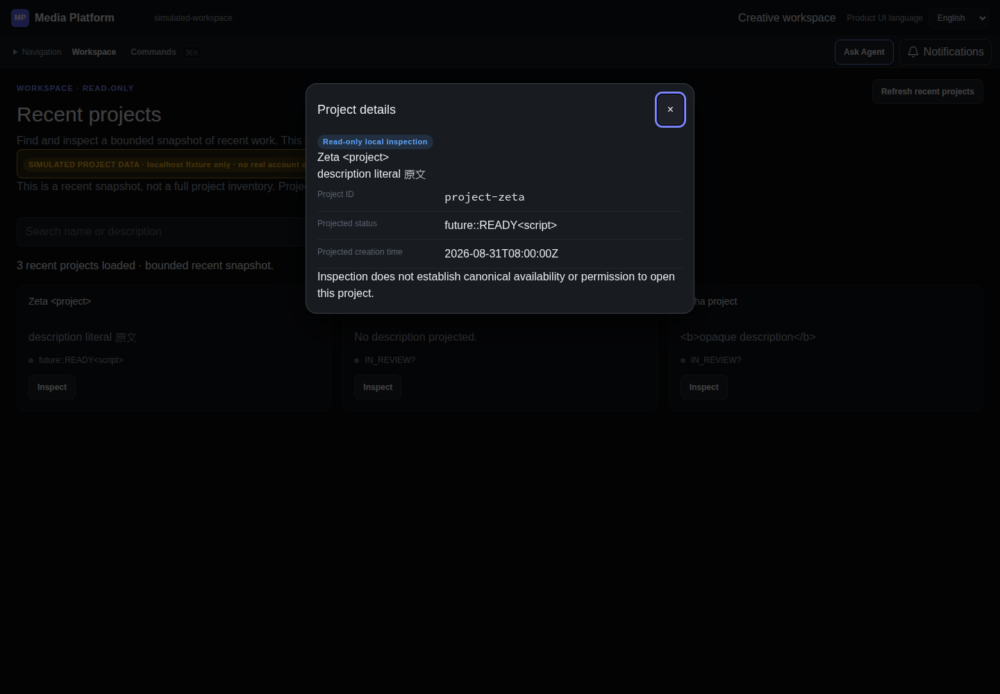
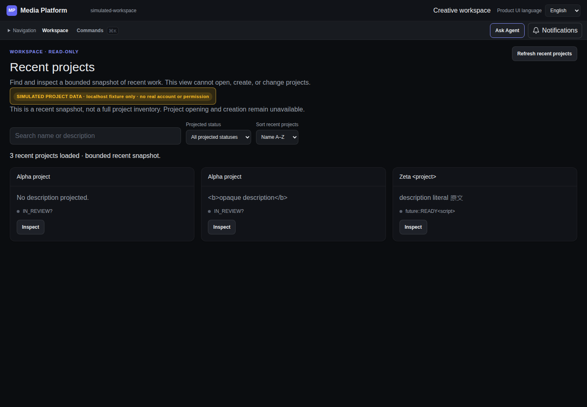
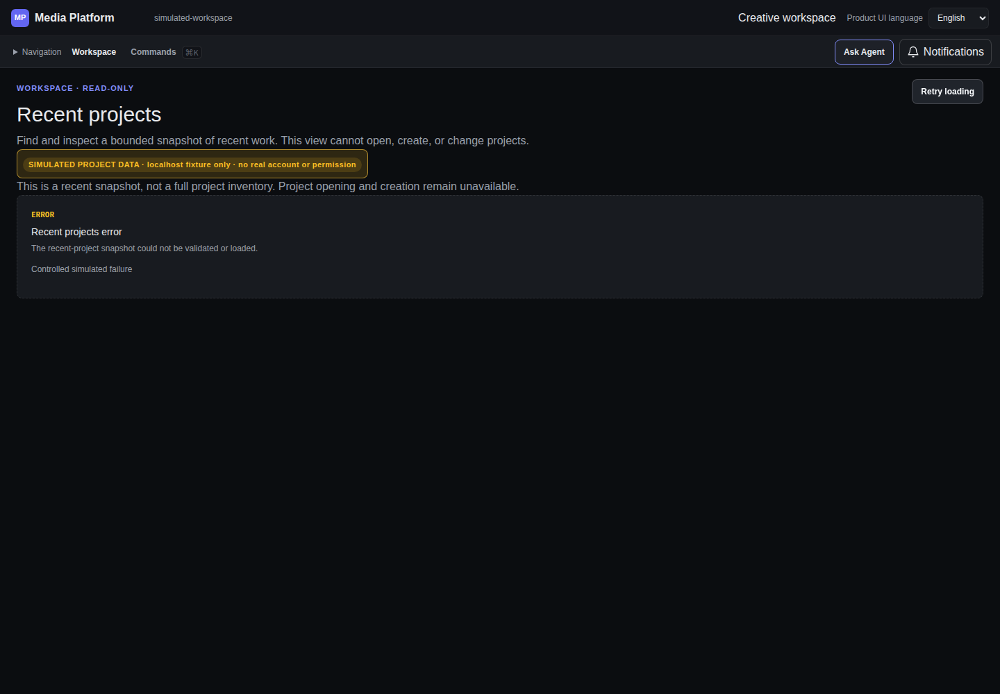
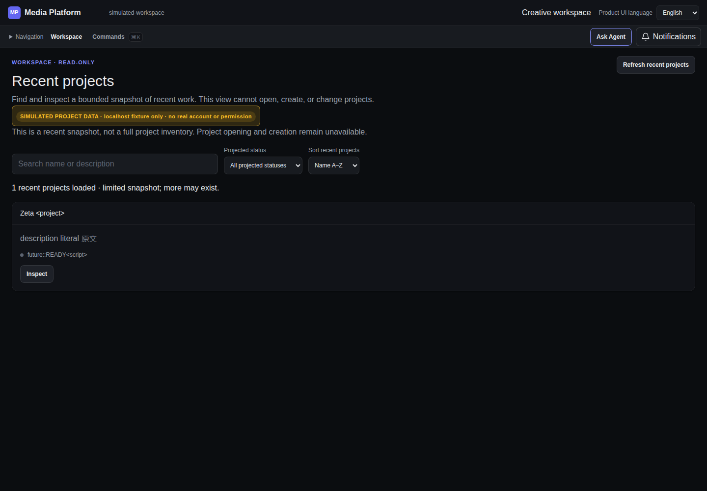
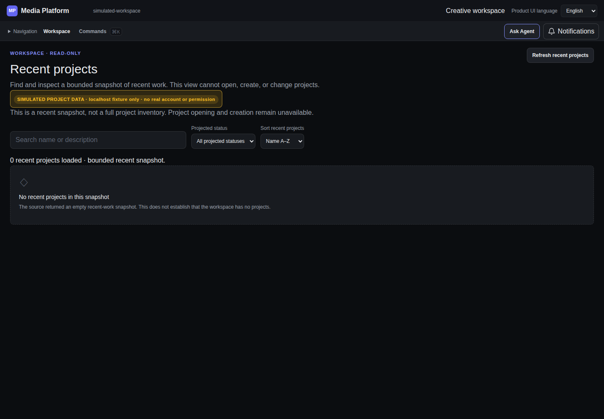
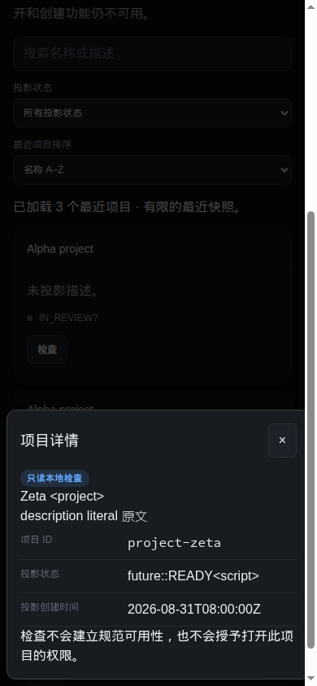
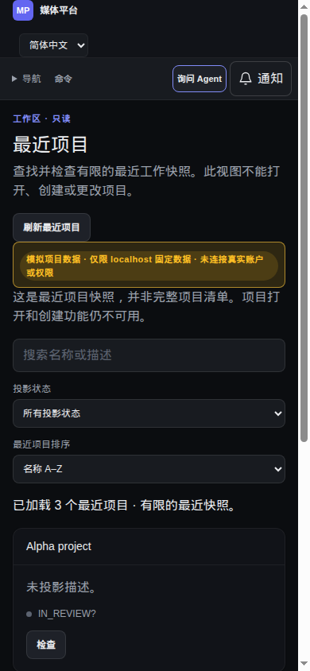
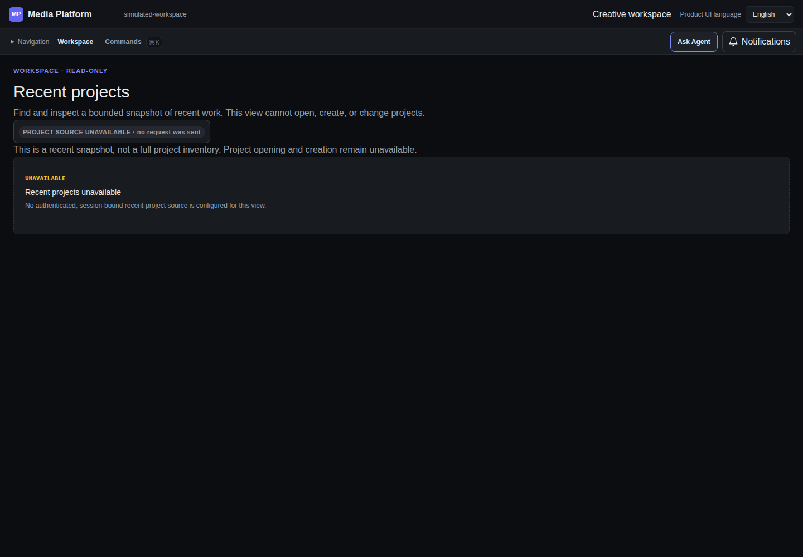
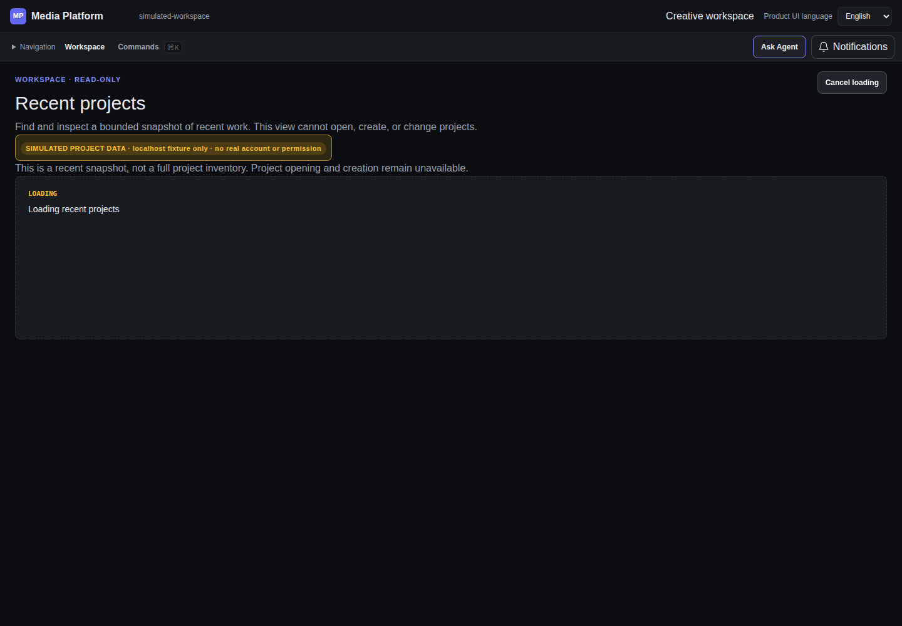
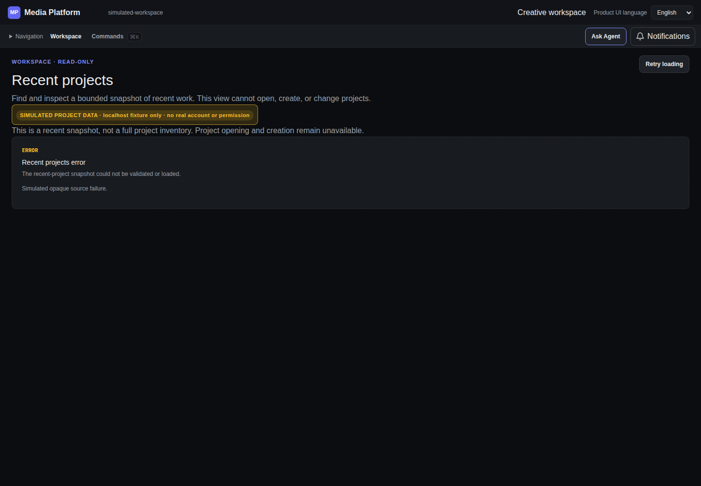

# Native Chromium screenshot gallery

**All project data below is an explicit localhost simulation, not real integration.** Viewport emulation: desktop 1440×1000, narrow 390×844. Images supplement the [36 executed assertions](final-validation/browser/NATIVE_CHECKS.json), not replace input/lifecycle records.

## desktop-details

## desktop-recent

## failed-refresh

## limited-snapshot

## loaded-empty

## narrow-chinese-details

## narrow-chinese

## ordinary-unavailable

## pending-refresh

## state-denied

## state-error

## state-unavailable

## state-unknown

## state-unsupported

